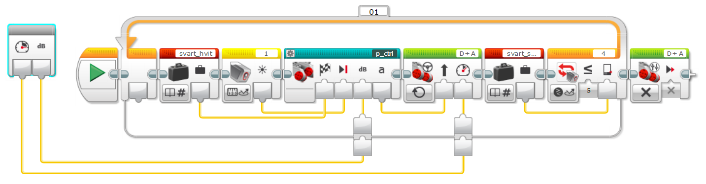

# MyBlocks i navigasjon.ev3

## LF_R_stop_L

Linjefølger som følger strek med høyre sensor. Stopper når venstre sensor ser svart.
#### Input
* Speed
* kP som sier hvor aggresiv styringen skal være.

## LF_L_stop_R
Linjefølger som følger strek med venstre sensor. Stopper når høyre sensor ser svart.
#### Input
* Speed
* kP som sier hvor aggresiv styringen skal være.

## LF_R_stop_dist
Linjefølger som følger strek med høyre sensor. Stopper etter gitt avstand.
#### Input
* Speed
* kP - Hvor aggresiv styringen skal være.
* cm - Hvor langt skal roboten kjøre før den stopper

## LF_L_stop_dist
Linjefølger som følger strek med venstre sensor. Stopper etter gitt avstand.
#### Input
* Speed
* kP - Hvor aggresiv styringen skal være.
* cm - Hvor langt skal roboten kjøre før den stopper

## drive_fwd_stop_r
Kjører rett fram, stopper når høyre sensor ser svart.
#### Input
* Speed

## drive_fwd_stop_L
Kjører rett fram, stopper når venstre sensor ser svart.
#### Input
* Speed

## drive_dist
kjører gitt antall cm. Kan også svinge.
#### Input
* Speed
* cm - Hvor langt skal roboten kjøre før den stopper
* Steering - Tall som angir styring. 0 er rett frem.

## vri_grader
Vrir roboten gitt antall grader.
#### Input
* Grader - Hvor mange grader skal roboten vris. Positivt tall er med klokken.
* kP - Hvor aggresiv styringen skal være.

## trippteller
Hjelpeblokk som brukes til stopp på rett avstand. Regner gjennomsnittsverdien på høyre og venstre kjøremotor.
#### Output
* Gjennomsnittsverdi av hvor mange grader høyre og venstre hjul har rotert siden oppstart.

## p_ctrl
Prpposjonal kontroller til bruk i blant annet linjefølger.
#### Input
* target - Ønsket sensorverdi
* current - Målt sensorverdi
* kP - Hvor aggresiv korreksjon skal gjøres
#### Output
* steering - Tall som gir hastighet eller styreretning på motor som skal styres.
